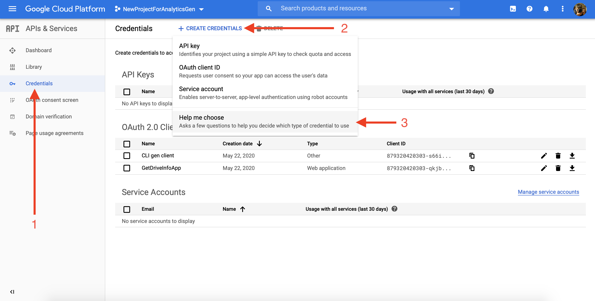
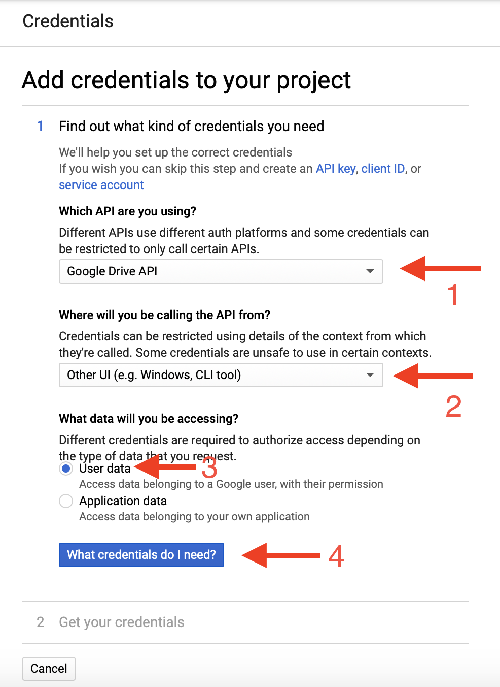
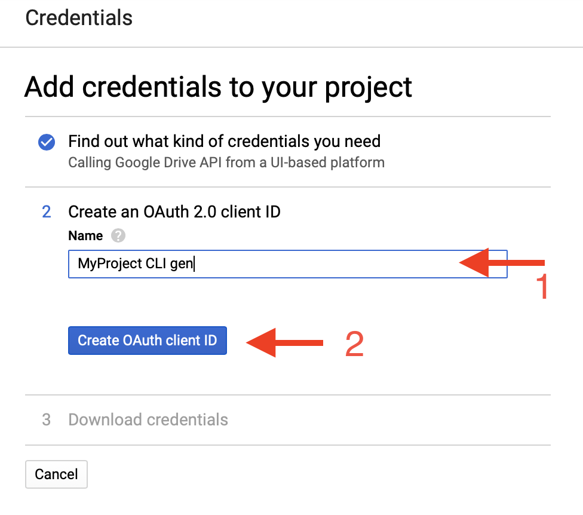
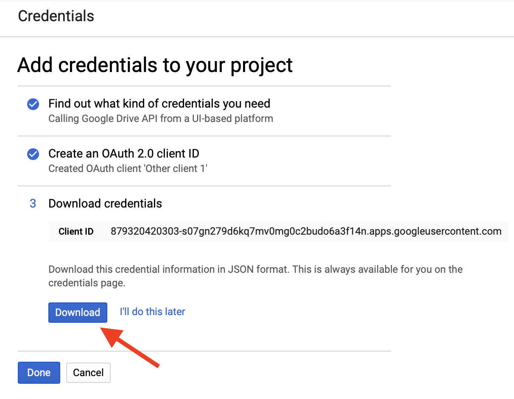

# Integration guide

1. [Recieve google credentials](#Recieve-google-credentials)
2. [Prepare Google Sheet](spreadsheet.md)
3. [Prepare config and templates files](#Prepare-config-and-templates-files)
4. [Install script via CocoaPods](#Install-script-via-CocoaPods)
5. [Setup makefile](#Setup-makefile)

## Recieve google credentials

1. Go to google console and [create project](https://console.cloud.google.com/projectcreate)
2. Enable Drive API (could be found by searching `Google Sheets API`)
3. Open panel `APIs & Services`
4. Add `OAuth consent screen` if it doesn't esist
5. Follow steps described in pictures






6. Create file (for example with name `google.json`) and copy JSON struct from [resources](#Google credentials)
7. Find `client_secret` and `client_id` in downloaded json file and place it in created file (for example `google.json`)

## Prepare config and templates files

1. Create `analytics_gen_config.yaml` file and place into your project
2. Prepare [templates](templates.md)
    1. Template for event category (required)
    2. Template for custom enum (required)
    3. Template for category extension (optional)
3. Copy base config structure (copy from [resources](#Config)) and edit it according to yours needs. Description of config you can find [here](config.md).

## Installation

1. Add to podfile `pod 'AnalyticsGen', '0.1.4'` or download binary manually from last release (for macOS users) or build source files manually (for ubuntu users)
2. Setup calling binary from Makefile (optional)
    1. Fill name command to invoke generator (for example `analytics_gen`)
    2. Fill command to invoke generator
        - for Cocoapods `Pods/AnalyticsGen/bin/AnalyticsGen configFilePath={path_to_your_config}`
        - for manual installation write path to your binary and pass to binary path to config

## Resources

### Google credentials

```json
{
    "client_id": "some_client_id",
    "authorize_url": "https://accounts.google.com/o/oauth2/auth",
    "token_url": "https://oauth2.googleapis.com/token",
    "client_secret": "client_secret",
    "callback": "/google/callback"
}
```

### Config

```yaml
language: "swift"
credentials_file_path: "google.json"
categories_extension_template_path: "analytics_category_template.stencil"
categories_extension_output_path: "output"
events_module_config:
  naming_postfix: "event_category"
  template_file_path: "events_category_template.stencil"
  output_folder_path: "output/EventCategories"
  spreadsheet_config:
    id: "1_w6NmTK4Ju3i2PacB4-D7WCvpWduikBYnvw2PSi2c9c"
    page_name: "Version_1.0"
    range: "A2:G100"
user_properties_module_config:
  naming_postfix: "user_properties"
  template_file_path: "user_properties_template.stencil"
  output_folder_path: "output/"
  spreadsheet_config:
    id: "1_w6NmTK4Ju3i2PacB4-D7WCvpWduikBYnvw2PSi2c9c"
    page_name: "UserProperties_1.0"
    range: "A2:G100"
custom_enum_module_config:
  naming_postfix: "custom_enum"
  template_file_path: "custom_enums_template.stencil"
  output_folder_path: "output/CustomEnums"
  spreadsheet_config:
    id: "1_w6NmTK4Ju3i2PacB4-D7WCvpWduikBYnvw2PSi2c9c"
    page_name: "Types"
    range: "A2:D100"`
```
