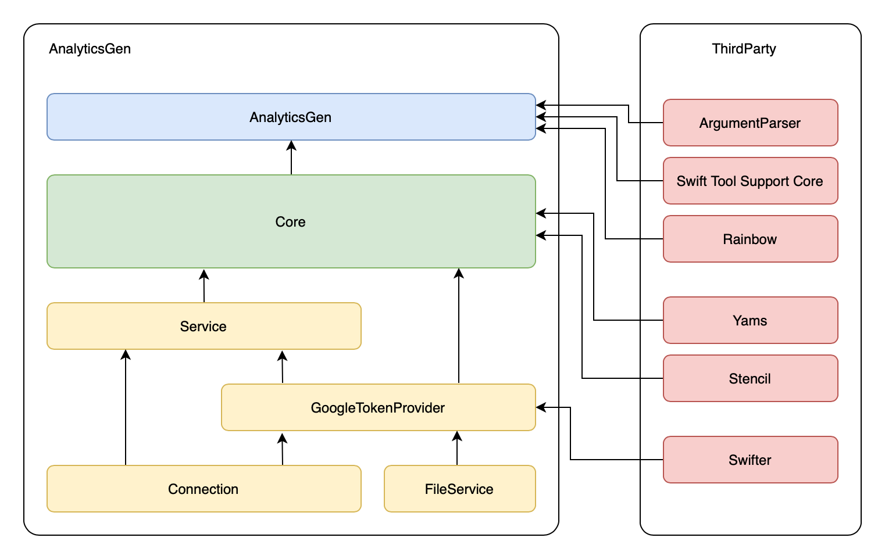

# Project for generating analytics layer in mobile app

The script written in swift is used to automatically generate the analytics layer for mobile application (both iOS and android).

## Modularity

## Base architecture

## GoogleTokenProvider

Provider for authorizing user via google with Google OAuth 2.0

